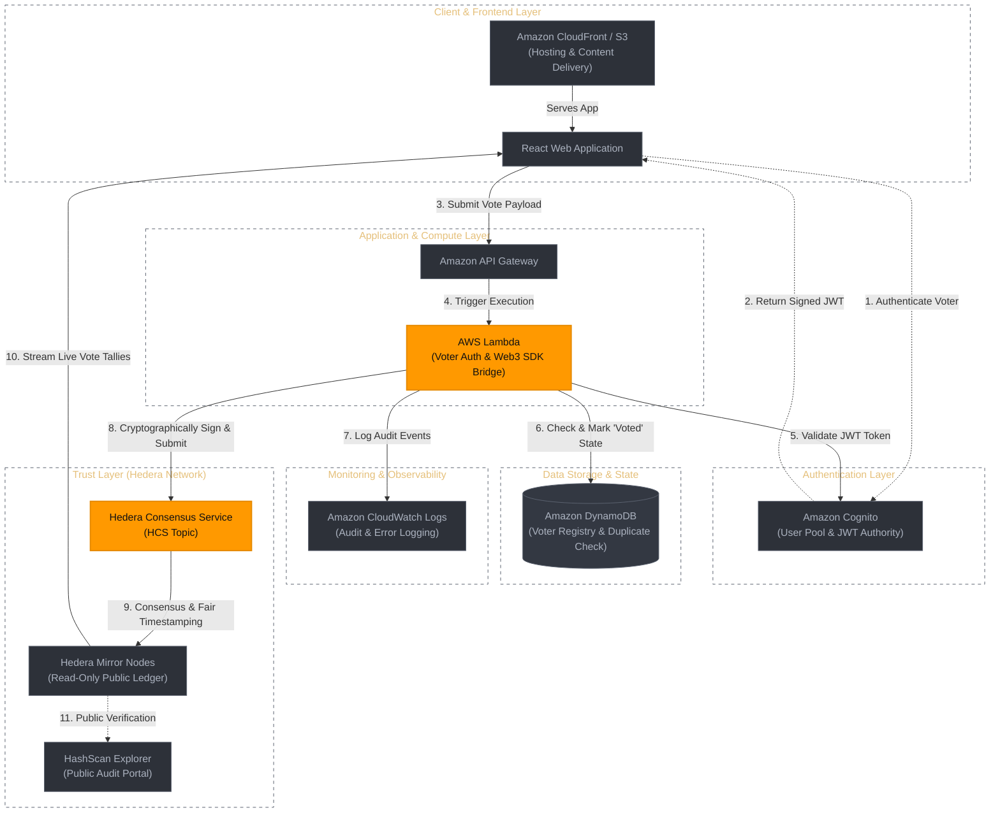

# Hybrid Cloud and Distributed Ledger E-Voting System

[](https://aws.amazon.com/)
[](https://hedera.com/)
[](https://reactjs.org/)
[](https://opensource.org/licenses/MIT)

## 📖 Executive Summary
The **Hybrid Cloud and Distributed Ledger E-Voting System** is an enterprise-grade, tamper-proof electronic voting application. This project bridges traditional serverless cloud computing with Web3 Distributed Ledger Technology (DLT).

By decoupling user management from vote immutability, the system utilizes an AWS serverless backend for fast user authentication, authorization, and API routing, alongside the Hedera public network for consensus and immutable vote logging. This architecture achieves high throughput for public elections while maintaining complete cryptographic security against database manipulation.

---

## 📂 Project Directory Structure

```text
hybrid-cloud-evoting-system/
├── architecture/
│   ├── system-architecture.png     # Rendered architecture diagram
│   └── architecture.mmd            # Mermaid diagram source code
├── backend/
│   ├── index.js                    # AWS Lambda execution function
│   ├── createTopic.js              # Script to create Hedera HCS Topic
│   ├── package.json                # Dependencies (@hashgraph/sdk, aws-sdk)
│   └── .env.example                # Template for environment configuration
├── frontend/
│   ├── public/                     # Static HTML & assets
│   ├── src/
│   │   ├── components/             # React UI components (VoteCard, Results)
│   │   ├── App.js                  # Main app layout and routing
│   │   └── index.js                # React application entry point
│   └── package.json                # Frontend dependencies
├── presentation/
│   ├── presentation.pptx           # Slide deck for project demonstration
│   └── generate_ppt.vba            # VBA automation script for slide deck
├── .gitignore
├── LICENSE                         # MIT License
└── README.md                       # System documentation

```

---

## 📐 System Architecture

The following diagram illustrates the hybrid data pipeline, moving from user authentication through serverless AWS compute down to Hedera's decentralized ledger.



---

## ⚡ Core Components & Tech Stack

| Layer | Component | Function |
| --- | --- | --- |
| **Frontend** | **React & Amazon CloudFront/S3** | Delivers a fast, responsive user dashboard with global low-latency content distribution. |
| **Identity** | **Amazon Cognito** | Authenticates users, issues secure JWT tokens, and enforces electoral registration constraints. |
| **API & Compute** | **Amazon API Gateway & AWS Lambda** | Serverless architecture that validates API payloads and securely signs Hedera ledger transactions via `@hashgraph/sdk`. |
| **State Tracking** | **Amazon DynamoDB** | Tracks voter participation states to enforce a strict "one person, one vote" policy before sending data to the chain. |
| **Consensus** | **Hedera Consensus Service (HCS)** | Assigns immutable, cryptographic timestamps to transactions across a decentralized consensus network. |
| **Public Audit** | **Hedera Mirror Nodes & HashScan** | Provides read-only APIs allowing voters and external auditors to independently aggregate vote tallies. |

---

## 🚀 Key Features

* **Cryptographic Immutability:** Votes logged to the Hedera Consensus Service cannot be modified or deleted by any cloud administrator or malicious actor.
* **High Performance & Low Latency:** Leverages Hashgraph's aBFT consensus, processing 10,000+ TPS with finality in 3–5 seconds.
* **Predictable Micro-Transaction Costs:** Uses Hedera Consensus Service topics rather than gas-heavy smart contracts, keeping transaction fees fixed at $0.0001 USD.
* **Decoupled Verification:** Live election results are tallied directly from Hedera Mirror Nodes, bypassing the AWS database to ensure transparent auditing.

---

## 🛠️ Setup & Installation

### 1. Prerequisites

* [Node.js](https://nodejs.org/) (v16.x or later)
* [AWS CLI](https://aws.amazon.com/cli/) configured with proper IAM credentials.
* A free [Hedera Developer Portal](https://portal.hedera.com/) account (Testnet credentials).

### 2. Clone the Repository

```bash
git clone [https://github.com/YOUR-USERNAME/hybrid-cloud-evoting-system.git](https://github.com/YOUR-USERNAME/hybrid-cloud-evoting-system.git)
cd hybrid-cloud-evoting-system

```

### 3. Configure Backend Environment

Navigate to the `backend/` directory, install dependencies, and create your environment file:

```bash
cd backend
npm install

```

Create a `.env` file inside `/backend`:

```env
HEDERA_ACCOUNT_ID=0.0.xxxxx
HEDERA_PRIVATE_KEY=302e020100300506032b657004220420...
HCS_TOPIC_ID=0.0.yyyyy
DYNAMODB_TABLE_NAME=VoterRegistry

```

To automatically generate a new `HCS_TOPIC_ID` on the Hedera Testnet, run:

```bash
node createTopic.js

```

### 4. Deploy the AWS Backend

Deploy your Lambda functions, API Gateway, and DynamoDB table using your preferred deployment framework (AWS SAM, Serverless Framework, or manual AWS Console import):

```bash
npm run deploy

```

### 5. Launch the React Frontend

Navigate to the frontend directory, install dependencies, and start the development server:

```bash
cd ../frontend
npm install
npm start

```

---

## 🔄 Transaction Lifecycle Workflow

1. **Authentication:** Voter logs in via React UI; Amazon Cognito issues a signed JWT token.
2. **Payload Submission:** The React app sends an HTTP `POST` request with the selected `candidateId` and JWT to Amazon API Gateway.
3. **Validation & State Check:** AWS Lambda validates the JWT signature and checks Amazon DynamoDB to verify the user has not previously voted.
4. **Ledger Broadcast:** AWS Lambda signs the transaction using `@hashgraph/sdk` and submits the payload message to the Hedera Consensus Service.
5. **Consensus & Timestamping:** Hedera nodes establish fair, decentralized consensus and record the message to an immutable topic stream.
6. **Transparent Tallying:** The frontend queries Hedera Mirror Nodes directly to aggregate and render real-time results without relying on a centralized database.

---

## 🤝 Contributing & License

* **Contributing:** Issues and pull requests are welcome. Feel free to open an issue to discuss proposed architectural modifications.
* **License:** This project is open-source and available under the [MIT License](https://www.google.com/search?q=LICENSE).

```

```
